# artificial-reef-fisheries-data-qa-reporting-pipeline

[](https://github.com/ranjithguggilla/artificial-reef-fisheries-data-qa-reporting-pipeline/actions/workflows/ci.yml)


Reef survey data QA and reporting pipeline — validation, coverage analysis, export-ready datasets.

## Purpose

A public-data-safe prototype inspired by artificial reef and fisheries monitoring workflows.

## Demo media

Streamlit dashboard (**`streamlit run app.py`** after installing dependencies). Synthetic sample data only.

### Walkthrough GIF

Full UI walkthrough (**`assets/gifs/demo-overview.gif`**). Encoded at **3 fps** and **720px** width so the README stays fast to load on GitHub.

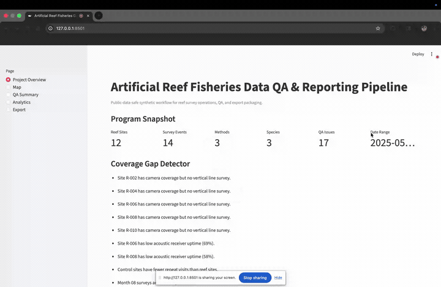

### Screenshots

<details>
<summary><strong>Expand: 14 dashboard screenshots</strong> (overview → map → QA → analytics → export)</summary>

| View | Preview |
|------|---------|
| Project overview | 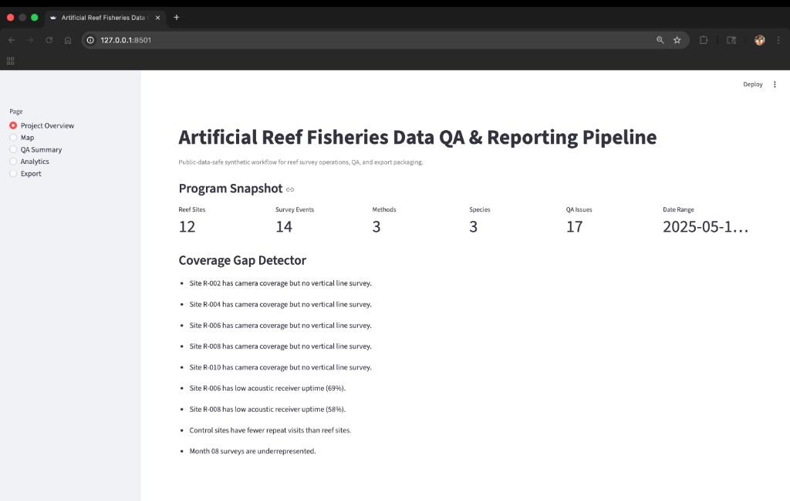 |
| Reef coverage map | 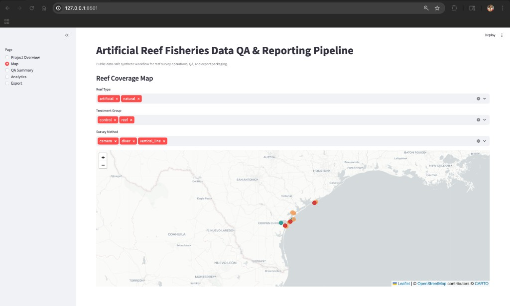 |
| QA findings table | 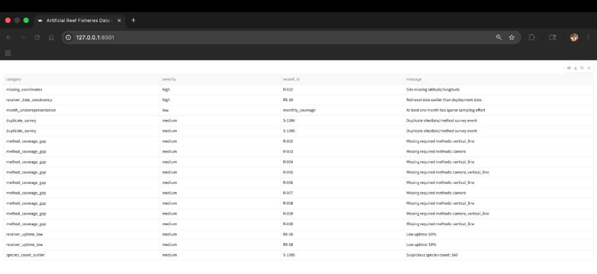 |
| QA Summary (page) | 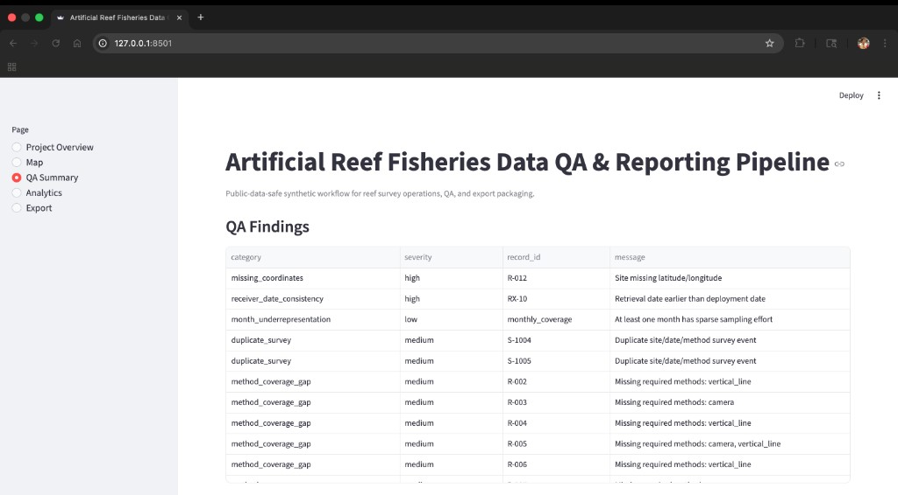 |
| QA matrix + weather limits | 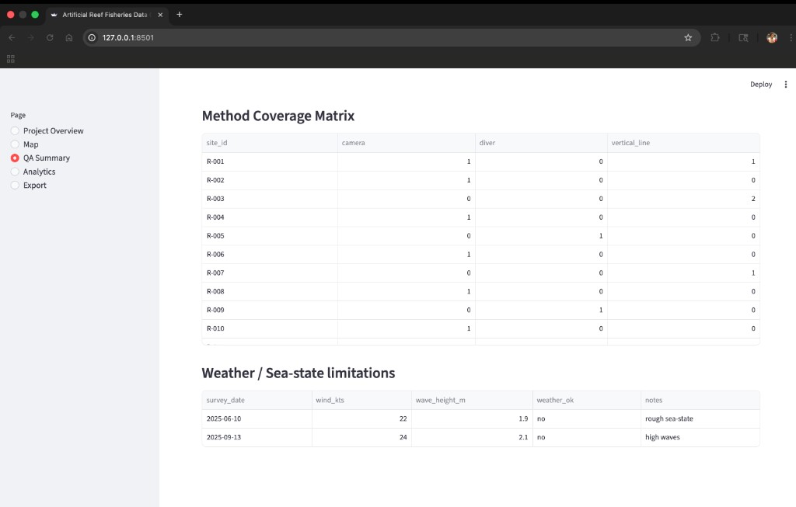 |
| Method coverage matrix | 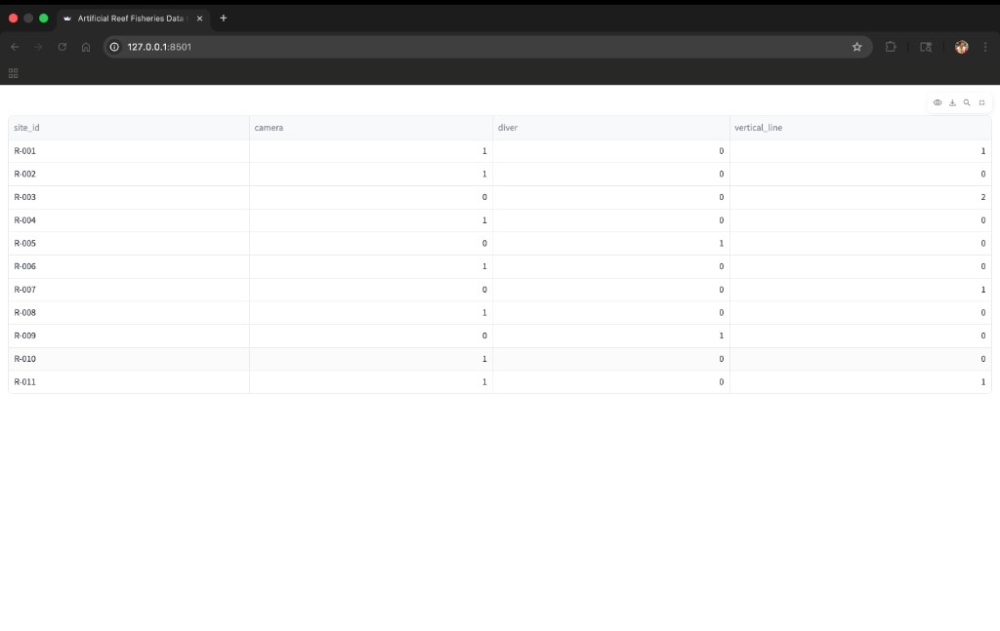 |
| Analytics — CPUE summary | 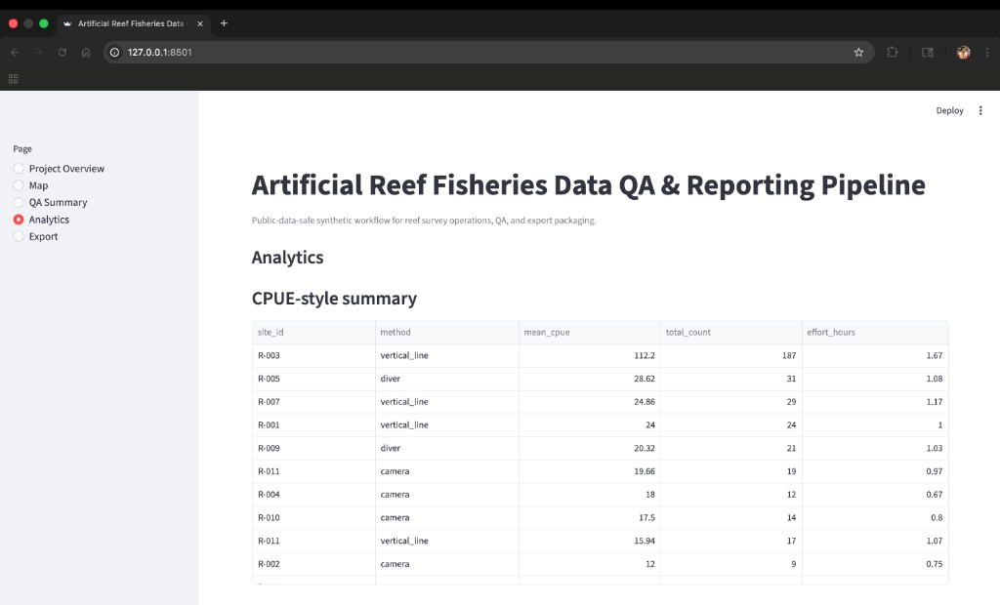 |
| Analytics — species richness | 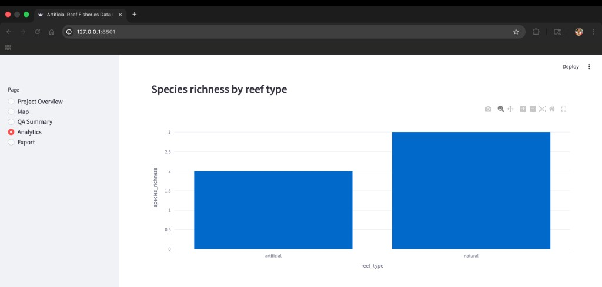 |
| Analytics — survey effort | 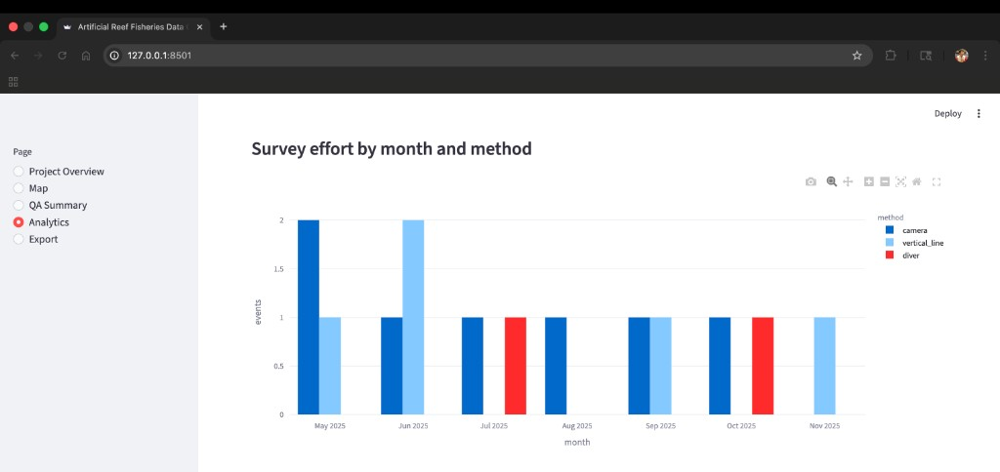 |
| Analytics — receiver trends | 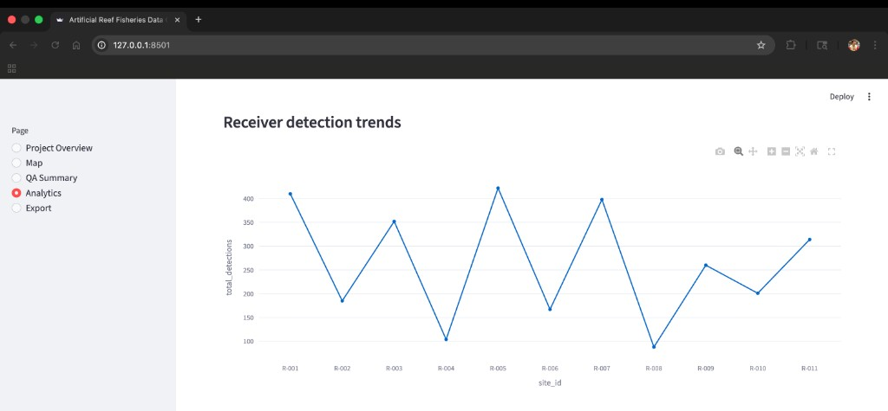 |
| Analytics — species by site | 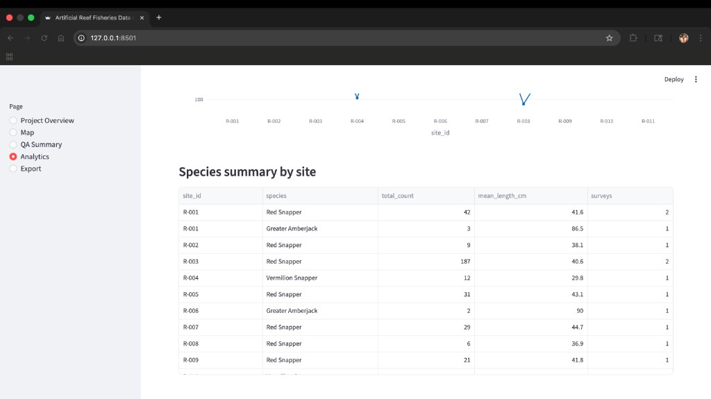 |
| Analytics — species table | 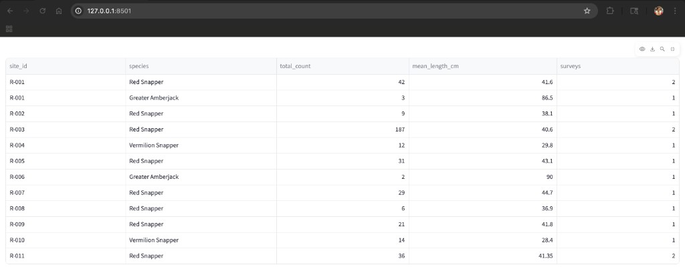 |
| Export — generate | 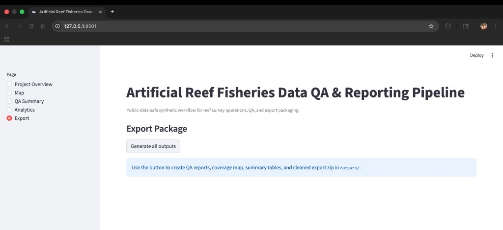 |
| Export — generated paths | 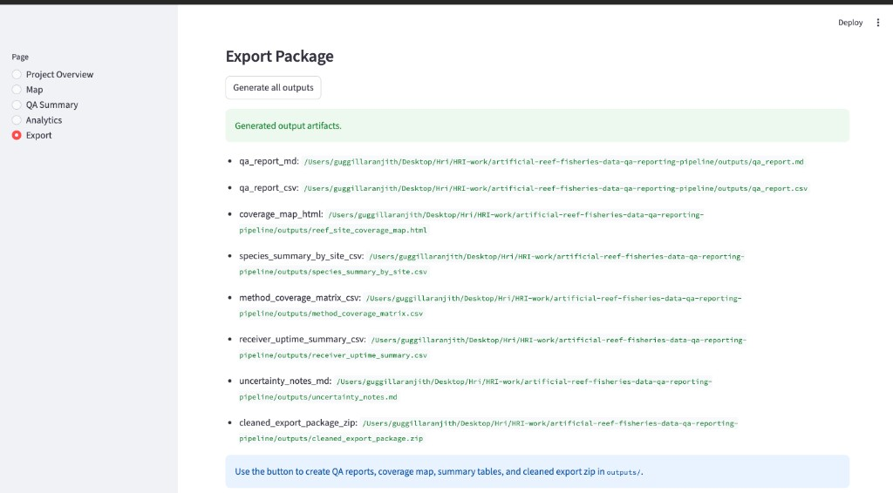 |

</details>

## Why this matters
Large field programs often combine reef metadata, survey methods, species counts, telemetry summaries, and environmental context. This demo shows how messy multi-method inputs can be standardized, quality-checked, summarized, and packaged for reproducible research reporting.

## What this demo does
- validates reef survey metadata
- maps survey coverage
- flags QA issues
- summarizes species counts and receiver uptime
- exports cleaned research-ready datasets

## Data note
This repository uses synthetic and public-safe sample data only.

## Workflow
raw data -> cleaning -> QA checks -> analytics -> maps -> export package

## Tech stack
Python, pandas, GeoPandas, Shapely, Streamlit, Folium, Plotly

## Run locally

1. Get the code and move into the project folder:

   ```bash
   git clone https://github.com/ranjithguggilla/artificial-reef-fisheries-data-qa-reporting-pipeline.git
   cd artificial-reef-fisheries-data-qa-reporting-pipeline
   ```

   Or `cd` to wherever you already keep a copy of this repository.

2. Create a virtual environment and install dependencies:

   ```bash
   python3 -m pip install -r requirements.txt
   ```

3. Generate QA outputs:

   ```bash
   python3 -m src.export_utils
   ```

4. Start dashboard:

   ```bash
   streamlit run app.py
   ```

You can also use `make` commands:

```bash
make setup
make run
```

**Contributors on GitHub:** run `git config core.hooksPath .githooks` once after clone so `Co-authored-by` lines are not added to commits.

## Quality checks

- Local smoke test:

  ```bash
  make smoke
  ```

- GitHub Actions runs `scripts/smoke_test.py` automatically on push/PR to `main`.

## Expected outputs
- `outputs/qa_report.md`
- `outputs/qa_report.csv`
- `outputs/reef_site_coverage_map.html`
- `outputs/species_summary_by_site.csv`
- `outputs/method_coverage_matrix.csv`
- `outputs/receiver_uptime_summary.csv`
- `outputs/uncertainty_notes.md`
- `outputs/cleaned_export_package.zip`

## Possible research support value
This kind of workflow can support field-program organization, QA, and reporting readiness without overclaiming biological inference.
